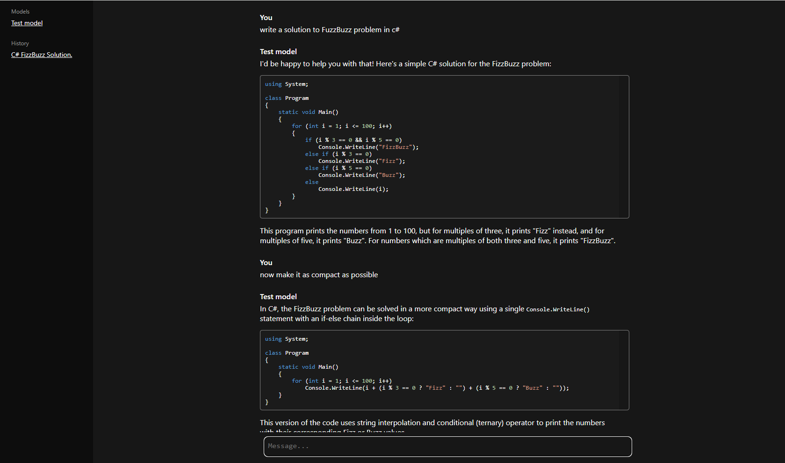

# 🦜️🔗 LangChain Chat


This project shows how to make a chat with LLM usgin [LangChain](https://github.com/tryAGI/LangChain) and Blazor.

# Features
- chat with any local or paid model
- have multiple models with any chain configurations(agents, RAG, custom tools, etc...)
- conversation history and multiple conversations
- automatic conversation name generation
- code syntax higlight

# Prerequisites
To run the chat with default configuration you would need `docker` and [ollama container](https://hub.docker.com/r/ollama/ollama).
Follow the installation steps for ollama container.
When eterything is ready, pull the latest mistral model:
```
docker exec -it ollama ollama pull mistral:latest
```
This will take some minutes, depending on your internet speed.
Now just clone the project and run it.

# Configuration
Just clone the project and open `LangChainConfigExtensions.cs` file.
There you can change your model provider, chain and add more models.

You can change provided from local ollama to ChatGPT or, pretty much, any existing model supported by LangChain.
For more information see [LangChain](https://github.com/tryAGI/LangChain) wiki.
